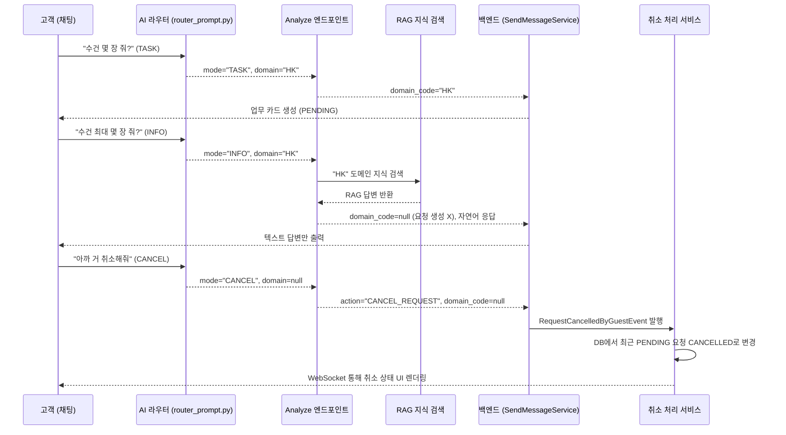

# 라우터 INFO & CANCEL 모드 구현 — AI 요청 분기 및 취소 파이프라인

> **브랜치**: `young/feat/AI-INFO-CANCEL` (권장)
> **목표**: 메인 라우터 프롬프트에 `INFO`(정보 문의)와 `CANCEL`(요청 취소) 모드를 추가하여, AI가 단순 정보성 질문과 고객의 취소 의도를 정확히 파악하도록 개선한다. 또한 백엔드에 이벤트 기반의 취소 처리 파이프라인을 구축한다.

---

## 🏗️ 전체 아키텍처 및 처리 흐름 (Workflow)



---

## 🎯 핵심 확정 사항

| # | 항목 | 결정 |
|---|---|---|
| 1 | INFO 모드 목적 | RAG를 통해 **답변만 제공**하고, 불필요한 요청(Task) **티켓 생성을 방지**함 (`domain_code=null`). |
| 2 | CANCEL 모드 목적 | 고객의 대화형 **취소 의도를 감지**하여, 특수 액션(`action="CANCEL_REQUEST"`)을 백엔드로 전달함. |
| 3 | 취소 대상 타겟팅 | 백엔드에서 해당 방+투숙객의 **가장 최근에 생성된 취소 가능한(PENDING/ASSIGNED) 요청 1건**을 타겟팅함. |
| 4 | 백엔드 통신 규격 | `MessageAiResult` DTO에 `action` 필드를 신설하여 확장성 확보. |
| 5 | 아키텍처 원칙 | 서비스 간 강결합 방지를 위해 **Spring ApplicationEvent**(`RequestCancelledByGuestEvent`)를 통한 비동기 이벤트 통신 사용. |

---

## 📝 상세 변경 사항 (Proposed Changes)

### Step 1. AI 서버 — 라우터 인지 범위 확장 (Python)

#### [MODIFY] `router_prompt.py`
- `mode` 분류 체계에 `INFO`와 `CANCEL` 2가지를 추가.
- 모호한 문맥 파악을 위해 `[과거 대화 맥락]`을 반드시 참조하도록 제약 조건(Constraints) 강화.

#### [MODIFY] `analyze.py`
- 라우터의 결과에 따라 분기 처리 로직 추가:
  - **`INFO` 분기**: 해당 부서의 RAG 지식을 검색하고 Gemini를 통해 자연스러운 문장으로 텍스트만 리턴. (`domain_code: None` 설정)
  - **`CANCEL` 분기**: 응답 딕셔너리에 `"action": "CANCEL_REQUEST"` 필드를 추가하여 리턴. (`domain_code: None` 설정)

---

### Step 2. 백엔드 — AI 응답 DTO 확장 (Java)

#### [MODIFY] `MessageAiResult.java`
- Record 클래스에 `String action` 필드 추가 (AI가 지시하는 특수 액션 수신용).

#### [MODIFY] `PythonAiHttpAdapter.java` & `MockAiAdapter.java`
- 파이썬 응답 JSON에서 `action` 값을 파싱하여 DTO에 매핑. (Mock 객체는 기본값 `null` 처리)

---

### Step 3. 백엔드 — 이벤트 기반 취소 파이프라인 (Java)

#### [NEW] `RequestCancelledByGuestEvent.java`
- 이벤트 페이로드 정의: `roomNo` (방 번호), `guestId` (투숙객 식별자)

#### [MODIFY] `SendMessageService.java`
- AI 결과 분기 처리 부분에서 `analysis.action() == "CANCEL_REQUEST"` 감지 시, `RequestCancelledByGuestEvent` 이벤트 발행.

#### [NEW] `CancelRequestOnEventService.java`
- `Request` 모듈 내에 이벤트 리스너를 생성.
- `onGuestCancel()`: 이벤트를 수신하여 **가장 최근 요청을 찾아 상태를 `CANCELLED`로 변경**하고, 웹소켓(`STATUS_CHANGED`) 알림 발송.

#### [MODIFY] `RequestRepositoryPort.java` & `RequestPersistenceAdapter.java`
- DB 조회용 포트 메서드 `findLatestCancellableByRoomNoAndGuestId(roomNo, guestId)` 추가. (상태가 PENDING 또는 ASSIGNED 인 최신 건 조회)

---

## 🚀 작업 순서 타임라인

| 순서 | 단계 | 핵심 작업 | 소요 예상 |
|---|---|---|---|
| **Phase 1** | **라우터 프롬프트 고도화** | `router_prompt.py` 수정 및 `analyze.py` 분기 로직 구현 | 1시간 |
| **Phase 2** | **AI 통신 스펙 확장** | 백엔드 `MessageAiResult` DTO 및 Adapter 수정 | 30분 |
| **Phase 3** | **이벤트 파이프라인 구축** | Event 객체, Publisher(Service), Listener(CancelService) 구현 | 1.5시간 |
| **Phase 4** | **DB 포트 확장** | 최근 취소 가능 요청 조회 쿼리 포트/어댑터 작성 | 30분 |

---

## ✅ 검증 계획 (Verification Plan)

작업 완료 후 아래 시나리오가 모두 정상 작동하는지 확인합니다.

### 1. 자동 테스트 (cURL)
```bash
# 시나리오 1: INFO (RAG 답변만 오고 action/domain_code 없음)
curl -X POST http://localhost:8000/analyze \
  -H "Content-Type: application/json" \
  -d '{"text": "수건 몇장까지 줘요?", "room_no": "101"}'

# 시나리오 2: CANCEL (action="CANCEL_REQUEST" 확인)
curl -X POST http://localhost:8000/analyze \
  -H "Content-Type: application/json" \
  -d '{"text": "아까 거 취소해주세요", "room_no": "101"}'
```

### 2. 프론트엔드 통합 (E2E) 테스트
1. **INFO 요청 방어**: 화면 채팅에서 "수건 한도 알려줘"라고 보냈을 때, "객실당 4장입니다"라는 답변만 오고, 하단에 **[요청 상태 게이지바] 위젯이 뜨지 않는지** 확인. (프론트/백엔드 모두 티켓 생성 방어 확인)
2. **채팅으로 취소**: 수건 2장 정상 요청 후, "방금 거 취소할래"라고 전송.
3. **UI 실시간 반영**: 기존에 떠있던 수건 요청 게이지바가 즉시 **빨간색(취소됨)** 상태로 변경되는지 확인.
4. **대시보드 동기화**: 관리자(직원) 웹 대시보드 화면에서도 해당 요청이 사라지거나 `CANCELLED` 처리되어 보이는지 확인.
