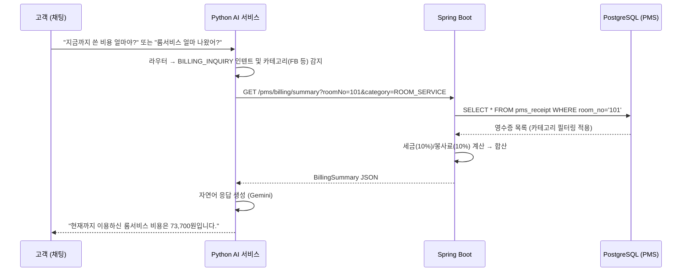

/ㅡㅐg# AN-321: 실시간 가상 PMS 연동을 통한 비용 조회 로직 구현

## 📋 개요

AI 챗봇이 고객의 비용 문의("지금까지 쓴 비용 얼마야?", "룸서비스 얼마 나왔어?")를 받으면,
**가상 PMS의 `pms_receipt` 테이블에서 실시간 Billing 데이터를 조회**하여 정확한 금액 정보를 자연어로 응답하는 기능을 구현합니다.

---

## 🏗️ 현재 아키텍처 분석

### 이미 존재하는 것 ✅
| 구성 요소 | 위치 | 설명 |
|---|---|---|
| `pms_receipt` 테이블 | `schema.sql` L194 | 객실별 영수증 (room_no, menu_id, quantity, total_price, status) |
| `PmsReceipt` 도메인 모델 | `pms/domain/model/` | 순수 POJO record |
| `PmsReceiptRepositoryPort` | `pms/application/port/out/` | `findByRoomNo()`, `findUnpaidByRoomNo()` 메서드 존재 |
| `ManagePmsReceiptUseCase` | `pms/application/port/in/` | `getReceiptsByRoomNo()`, `getUnpaidReceiptsByRoomNo()` 존재 |
| `ManagePmsReceiptService` | `pms/application/service/` | UseCase 구현체 (영수증 조회/결제 로직) |
| `PmsReceiptController` | `pms/adapter/in/web/` | REST API: `GET /pms/receipts?roomNo=xxx` |
| `GetPmsReceiptResult` DTO | `pms/application/dto/response/` | 영수증 조회 응답 DTO |
| AI 분석 파이프라인 | `ai/app/api/analyze.py` | 라우터 → 에이전트 → 응답 흐름 |

### 아직 없는 것 ❌
| 구성 요소 | 설명 |
|---|---|
| **비용 문의 인텐트 분류** | 라우터가 "비용 얼마야?"를 어떤 도메인/route_type으로 분류할지 정의되지 않음 |
| **비용 조회 전용 API** | AI 서비스가 백엔드 PMS 데이터를 조회할 수 있는 엔드포인트 (세금/봉사료 포함 합산 및 카테고리 필터링) |
| **비용 계산 엔진** | 세금(10%), 봉사료(10%) 포함 최종 결제 예정 금액 산출 로직 |
| **자연어 응답 템플릿** | 금액 데이터를 자연스러운 문장으로 변환하는 AI 프롬프트 |

---

## 🔄 전체 데이터 흐름 (목표)



---

## 📦 구현 Phase 분류

### Phase 1: Backend — 비용 조회 API 구축 (카테고리 필터링 포함)
> PMS 모듈에 Billing 요약 조회 기능 추가

#### 1-1. UseCase 정의 (`application/port/in/`)

```
📁 pms/application/port/in/
└── GetBillingUseCase.java        ← 신규
```

```java
public interface GetBillingUseCase {
    /** 객실별 비용 요약 조회 (세금/봉사료 포함, 선택적 카테고리 필터링) */
    GetBillingSummaryResult getBillingSummary(String roomNo, String category);
}
```

#### 1-2. Response DTO 정의 (`application/dto/response/`)

```
📁 pms/application/dto/response/
└── GetBillingSummaryResult.java  ← 신규
```

```java
public record GetBillingSummaryResult(
    String roomNo,
    String category,                    // 필터링 요청된 카테고리 (없으면 "ALL")
    List<BillingItemResult> items,     // 개별 항목 리스트
    int subtotal,                       // 소계 (세전)
    int tax,                            // 부가세 (10%)
    int serviceCharge,                  // 봉사료 (10%)
    int totalAmount,                    // 최종 합계
    String currency                     // "KRW"
) {}

public record BillingItemResult(
    String menuName,
    String category,
    int quantity,
    int unitPrice,
    int totalPrice,
    String createdAt
) {}
```

#### 1-3. Service 구현 (`application/service/`)

```
📁 pms/application/service/
└── GetBillingService.java        ← 신규
```

- `PmsReceiptRepositoryPort.findByRoomNo()` 호출
- **카테고리 필터링**: `category` 값이 전달되면, 해당 카테고리에 속하는 영수증 항목만 필터링합니다 (예: "룸서비스"만 조회).
- **비용 계산 로직**: 호텔 기본 정책에 따라 소계(Subtotal)에 **부가세(10%)와 봉사료(10%)**를 각각 합산하여 최종 결제 금액을 산출합니다.
- 영수증이 없을 경우 빈 결과 반환 (예외 아님)

#### 1-4. Controller 엔드포인트 (`adapter/in/web/`)

```
📁 pms/adapter/in/web/
└── PmsBillingController.java     ← 신규
```

| Method | Path | 설명 |
|---|---|---|
| `GET` | `/pms/billing/summary?roomNo=xxx&category=xxx` | 객실별/카테고리별 비용 요약 (AI 서비스가 호출) |

> [!IMPORTANT]
> 기존 `PmsReceiptController`와 분리합니다. 영수증 CRUD와 비용 조회/요약은 관심사가 다릅니다.

---

### Phase 2: AI — 비용 문의 인텐트 분류 & 라우팅

#### 2-1. 라우터 프롬프트 업데이트 (`ai/app/prompts/router_prompt.py`)

라우터에 새로운 `route_type: "BILLING_INQUIRY"`를 추가합니다.

```python
# router_prompt.py에 추가
# BILLING_INQUIRY: 고객이 현재 이용 금액, 비용 내역을 문의하는 경우
# - "지금까지 쓴 비용 얼마야?"
# - "룸서비스 얼마 나왔어?" (이 경우 entities에 category 추출)
# - "체크아웃할 때 얼마 내야 해?"
```

> [!TIP]
> **전용 `BILLING_INQUIRY` 타입을 사용하는 이유 (사용자 질문 2번에 대한 답변)**:
> 기존 `INFO` 타입은 단순히 지식 베이스(RAG)를 조회하여 텍스트만 뱉어주는 '안내성' 질의를 처리하는 용도입니다. 반면, "내 비용 얼마야?"는 RAG 검색으로 해결되는 것이 아니라, **1) 고객의 호실 번호 추출, 2) 타겟 카테고리 파악, 3) 백엔드의 가상 PMS REST API(동적 데이터) 호출**이라는 일련의 고유한 액션 파이프라인이 필요합니다. 따라서 `INFO`와 분리하여 독립된 `route_type`으로 선언해야 `analyze.py`에서 **"아, 이건 DB(API)를 찔러야 하는구나"**라고 명확하게 인식하고 예외 없이 API 호출 분기로 넘어갈 수 있습니다. 이로 인해 코드 분기 로직이 훨씬 안전하고 깔끔해집니다.

#### 2-2. 라우터 스키마 업데이트 (`ai/app/schemas/router.py`)

```python
# RouterOutputSchema에 BILLING_INQUIRY route_type 추가
VALID_ROUTE_TYPES 상수에 "BILLING_INQUIRY" 추가
```

#### 2-3. analyze.py 비용 조회 분기 추가 (`ai/app/api/analyze.py`)

```python
# STEP 3 순회 내 새 분기:
if primary.route_type == "BILLING_INQUIRY":
    # 1) 라우터가 추출한 entities에서 category (예: '룸서비스', '미니바') 파악
    target_category = primary.entities.get("category", "ALL")
    
    # 2) 백엔드 PMS Billing API 호출 (카테고리 파라미터 포함)
    billing_data = await fetch_billing_summary(request.room_no, target_category)
    
    # 3) 데이터가 없으면 "이용 내역이 없습니다" 응답
    if not billing_data["items"]:
        response = { "guest_reply": "현재까지 이용 내역이 없습니다.", ... }
    else:
        # 4) Gemini로 자연어 응답 생성
        response = await generate_billing_reply(billing_data, request.language)
    
    final_responses.append(response)
    continue
```

---

### Phase 3: AI — 자연어 응답 생성

#### 3-1. 비용 응답 프롬프트 작성 (`ai/app/prompts/billing_prompt.py`)

```
📁 ai/app/prompts/
└── billing_prompt.py             ← 신규
```

- 금액 데이터를 입력받아 자연스러운 한국어/영어 응답 생성
- 예시 출력: "현재까지 이용하신 룸서비스 비용은 총 55,000원입니다. (소계 50,000원 + 부가세 5,000원)"

#### 3-2. Billing 헬퍼 함수 (`ai/app/domains/billing/`)

```
📁 ai/app/domains/billing/       ← 신규 도메인 모듈
├── __init__.py
└── service.py                   ← 백엔드 API 호출 + 응답 포맷팅
```

```python
async def fetch_billing_summary(room_no: str, category: str = None) -> dict:
    """백엔드 /pms/billing/summary API 호출"""
    # ... 카테고리 쿼리 파라미터 포함하여 호출
```

---

### Phase 4: 예외 처리 및 엣지 케이스

| 시나리오 | 처리 방식 |
|---|---|
| 영수증 데이터 없음 | "현재까지 이용 내역이 없습니다." 정적 응답 |
| 카테고리별 데이터 없음 | "현재까지 [해당 카테고리] 이용 내역이 없습니다." 응답 |
| 백엔드 API 호출 실패 | "비용 조회에 일시적 오류가 발생했습니다. 프론트에 문의해 주세요." |
| 다국어 지원 | Gemini 프롬프트에 language 파라미터 전달 |

---

## 📁 생성/수정 파일 요약

### Backend (Spring Boot)

| 작업 | 파일 | 유형 |
|---|---|---|
| 🆕 생성 | `pms/application/port/in/GetBillingUseCase.java` | Port In |
| 🆕 생성 | `pms/application/dto/response/GetBillingSummaryResult.java` | Response DTO |
| 🆕 생성 | `pms/application/dto/response/BillingItemResult.java` | Response DTO |
| 🆕 생성 | `pms/application/service/GetBillingService.java` | Service |
| 🆕 생성 | `pms/adapter/in/web/PmsBillingController.java` | Controller |

### AI (Python FastAPI)

| 작업 | 파일 | 유형 |
|---|---|---|
| ✏️ 수정 | `ai/app/prompts/router_prompt.py` | 라우터 프롬프트 |
| ✏️ 수정 | `ai/app/schemas/router.py` | 스키마 |
| ✏️ 수정 | `ai/app/core/router_engine.py` | 라우터 엔진 |
| ✏️ 수정 | `ai/app/api/analyze.py` | 분석 엔드포인트 |
| 🆕 생성 | `ai/app/prompts/billing_prompt.py` | 비용 응답 프롬프트 |
| 🆕 생성 | `ai/app/domains/billing/__init__.py` | 모듈 init |
| 🆕 생성 | `ai/app/domains/billing/service.py` | Billing 서비스 |

---

## ✅ Acceptance Criteria 검증

- [x] "지금까지 쓴 비용 얼마야?" → 가상 PMS 실데이터가 반영된 전체 답변 출력
- [x] "룸서비스 얼마 나왔어?" → **룸서비스 카테고리만 필터링된** 비용 합산 답변 출력
- [x] 데이터 없을 경우 → "이용 내역이 없습니다" 예외 처리 정상 동작
- [x] 세금(10%) 및 봉사료(10%)가 정확히 합산된 최종 금액 계산

---

> [!NOTE]
> **헥사고날 아키텍처 준수 사항**
> - `GetBillingService`는 `PmsReceiptRepositoryPort`만 의존 (JPA Repository 직접 import 금지)
> - `PmsBillingController`는 `GetBillingUseCase` 인터페이스만 의존
> - AI 서비스는 Backend REST API만 호출 (DB 직접 접근 금지)
> - Spring Boot에서 Gemini 직접 호출 금지 (Python AI 서비스 경유)
