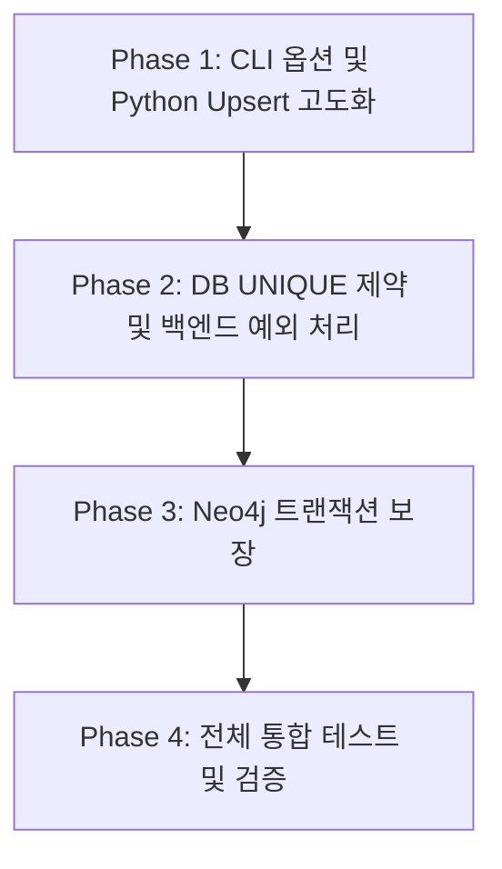

# AN-349 ~ AN-351 RAG 파이프라인 안정화 계획

본 계획서는 다음 세 가지 연관 티켓을 일괄 해결하기 위한 통합 설계 및 구현안을 정의합니다:
1. **[AN-349] Neo4j 부분 적재 시 트랜잭션 보장 및 예외 처리 고도화**
2. **[AN-350] 적재 스크립트 강제 재임베딩(--force) 지원 및 해시 키 정렬화**
3. **[AN-351] `knowledge_entry` 테이블 `(domain_code, question)` UNIQUE 제약 조건 추가**

> **참고:** 본래 함께 묶여있던 **AN-348 (Orphan Removal 자동 동기화)** 은 별도 검토 결과 **폐기**되었습니다.
> 사유:
> - SEED 데이터(`knowledge_data.py`)는 기초 정보만 포함하며 사실상 삭제되는 일이 없음
> - 운영 중 발생/삭제되는 RAG 데이터(STAFF 등록, ADMIN 등록)는 이미 어드민 UI(`FrontdeskKnowledgeController`)로 관리 가능
> - 출처(source) 구분 컬럼 없이 자동 DELETE를 도입하면 직원/어드민이 등록한 운영 데이터까지 통째로 삭제될 위험 존재
> - 따라서 자동 동기화 DELETE는 도입하지 않음. SEED 항목을 정리할 일이 발생하면 RAG 관리 페이지에서 1회성 수동 삭제로 처리

---

## 1. Neo4j 트랜잭션 보장 (AN-349)

### 🚨 현재 문제점
`ai/ingest_graph.py`의 `ingest_to_neo4j`는 노드와 관계를 순차적으로 `session.run()` 호출합니다. 도중에 한 쿼리가 실패하면 **앞서 적재된 노드/관계는 남고, `SystemMeta` 해시는 갱신되지 않은** 부분 적재 상태가 됩니다. 다음 실행에서 해시가 다르므로 재시도되긴 하지만, 실패 흔적이 누적될 수 있습니다.

### 🛠️ 설계 개요
**적재(MERGE) + SystemMeta 해시 갱신을 단일 쓰기 트랜잭션(`session.execute_write`)으로 묶어 ALL-OR-NOTHING을 보장**합니다.

- 적재 중 어떤 단계에서든 예외 발생 시 → 자동 롤백 → SystemMeta 미갱신 → 다음 실행 시 자연스럽게 재시도
- "청소" 단계는 도입하지 않음 (AN-348 폐기 결정에 따라). 따라서 도메인 태깅(`domains` 리스트 속성)이나 마이그레이션도 불필요

### 💻 변경 내용 (`ai/ingest_graph.py`)

#### 1. 트랜잭션 함수 분리
기존 `ingest_to_neo4j(session, ...)`, `update_system_meta(session, ...)`를 `tx` 기반 함수로 분리:

```python
def ingest_to_neo4j_tx(tx, graph_data):
    """전달받은 트랜잭션을 통해 엔티티/관계를 MERGE 합니다."""
    for entity in graph_data.get("entities", []):
        label = entity["label"]
        name = entity["id"]
        query = f"MERGE (n:{label} {{name: $name}})"
        tx.run(query, name=name)

    for rel in graph_data.get("relations", []):
        source_name = rel["source"]
        target_name = rel["target"]
        rel_type = rel["type"]
        query = f"""
        MATCH (source {{name: $source_name}})
        MATCH (target {{name: $target_name}})
        MERGE (source)-[r:{rel_type}]->(target)
        """
        tx.run(query, source_name=source_name, target_name=target_name)


def update_system_meta_tx(tx, domain: str, new_hash: str):
    """SystemMeta 노드의 해시를 갱신합니다. (트랜잭션 내부 실행)"""
    tx.run(
        """
        MERGE (m:SystemMeta {domain: $domain})
        SET m.hash = $hash, m.updated_at = datetime()
        """,
        domain=domain,
        hash=new_hash,
    )


def execute_domain_ingestion_transaction(tx, domain: str, graph_data: dict, new_hash: str):
    """
    한 도메인의 신규 데이터 적재 + 해시 갱신을 단일 트랜잭션으로 처리.
    부분 실패 시 SystemMeta가 갱신되지 않도록 보장(ALL-OR-NOTHING).
    """
    ingest_to_neo4j_tx(tx, graph_data)
    update_system_meta_tx(tx, domain, new_hash)
```

#### 2. 메인 파이프라인 흐름 변경
기존 도메인 루프에서 개별 호출 대신 `session.execute_write`로 트랜잭션 단위 실행:

```python
                    session.execute_write(
                        execute_domain_ingestion_transaction,
                        domain,
                        graph_data,
                        new_hash,
                    )
```

---

## 2. 강제 재임베딩(--force) 및 해시 키 정렬화 (AN-350)

### 🛠️ 설계 개요
1. **강제 재임베딩 (`--force`)**: 임베딩 모델 업그레이드나 프롬프트 구조 변경 등으로 DB 내용이 동일해도 재생성이 필요한 경우, 스킵 조건을 우회.
2. **해시 키 정렬화**: `knowledge_data.py` 내 질문 순서만 바뀌어도 해시값이 달라져 불필요한 Gemini API 호출이 발생하는 문제를 방지.

### 💻 변경 내용

#### 1. `ai/app/domains/rag/service.py` — `force` 파라미터 추가
```python
def upsert_knowledge_entry(cur, domain_code: str, question: str, answer: str, force: bool = False) -> str:
    cur.execute(
        "SELECT answer FROM knowledge_entry WHERE domain_code = %s AND question = %s",
        (domain_code, question),
    )
    row = cur.fetchone()

    if row is None:
        # INSERT 로직...
        return "inserted"

    if row[0] != answer or force:  # force가 True면 동일해도 재임베딩
        # UPDATE 로직...
        return "updated"

    return "skipped"
```

#### 2. `ai/app/domains/*/seed_knowledge.py` 및 `ai/seed_all.py` — CLI 인자 처리
```python
import argparse

parser = argparse.ArgumentParser()
parser.add_argument("--force", action="store_true", help="동일 answer여도 강제 재임베딩")
args = parser.parse_args()
# ...
result = upsert_knowledge_entry(cur, "XX", question, answer, force=args.force)
```

`seed_all.py`는 6개 도메인 스크립트를 subprocess로 실행할 때 `--force` 인자를 전파합니다.

#### 3. `ai/ingest_graph.py` — 정렬 + `--force`
**해시 정렬**: 질문 순서 변경으로 인한 캐시 만료 방지.
```python
def get_all_knowledge_texts():
    # ...
                        texts = []
                        for item in knowledge_list:
                            texts.append(f"Q: {item['question']}\nA: {item['answer']}")
                        texts.sort()  # 순서 무관 해시
                        domain_texts[domain] = "\n\n".join(texts)
```

**`--force` 옵션**: `argparse`로 파싱 후 `should_skip_ingestion` 결과를 `False`로 override.

> **참고:** 해시 정렬은 `ingest_graph.py`에만 적용합니다. Vector DB 시딩(`seed_all.py`)은 해시 캐싱 없이 질문별 답변 내용을 직접 비교(SELECT → INSERT/UPDATE/SKIP)하므로 순서 영향이 없습니다.

---

## 3. `knowledge_entry` UNIQUE 제약 조건 추가 (AN-351)

### 🛠️ 설계 개요
동시 실행 시 발생할 수 있는 Race Condition(동시 조회 → 동시 INSERT로 중복 발생)을 방지하고, `(domain_code, question)` 조회 성능 향상을 위해 복합 UNIQUE 제약을 추가합니다.

### ⚠️ 배포 전 사전 작업 (필수)

#### 1. 기존 중복 데이터 확인
UNIQUE 인덱스 생성은 **기존 데이터에 중복이 있으면 실패**합니다. 배포 전 반드시 다음 쿼리로 확인:

```sql
SELECT domain_code, question, COUNT(*) AS cnt, array_agg(id) AS ids
FROM knowledge_entry
GROUP BY domain_code, question
HAVING COUNT(*) > 1;
```

#### 2. 중복 해소 정책
중복 발견 시, 운영 데이터를 살리는 방향으로 정리. 권장 우선순위:

| 우선순위 | 유지 대상 |
|---|---|
| 1순위 | `status = 'APPROVED'` 중 가장 최근(`updated_at` 최대) |
| 2순위 | `approved_by IS NOT NULL` (직원/어드민 승인분) |
| 3순위 | `created_at`이 가장 오래된 row (SEED 가능성 ↑) |

수동 검토 후 삭제 SQL 작성. (자동화 스크립트는 사고 위험이 커서 권장하지 않음.)

### 💻 변경 내용

#### 1. `backend/src/main/resources/schema.sql` 수정
초기 스키마에 UNIQUE 제약 추가:
```sql
CREATE TABLE IF NOT EXISTS knowledge_entry (
    id              BIGSERIAL    PRIMARY KEY,
    question        TEXT         NOT NULL,
    answer          TEXT         NOT NULL,
    embedding       vector(768),
    domain_code     VARCHAR(20),
    status          VARCHAR(20)  NOT NULL DEFAULT 'PENDING',
    approved_by     BIGINT       REFERENCES staff(id),
    created_at      TIMESTAMP    NOT NULL DEFAULT NOW(),
    updated_at      TIMESTAMP    NOT NULL DEFAULT NOW(),
    CONSTRAINT unique_domain_question UNIQUE (domain_code, question)
);
```

마이그레이션 섹션(Section 8)에 기존 환경용 인덱스 추가:
```sql
-- [2026-05-20] RAG 동시성 보장을 위한 복합 UNIQUE 인덱스 추가
CREATE UNIQUE INDEX IF NOT EXISTS idx_knowledge_entry_unique_domain_question
ON knowledge_entry(domain_code, question);
```

#### 2. `ai/app/domains/rag/service.py` — `ON CONFLICT` 전환
UNIQUE 제약 후 기존 SELECT → INSERT 2단계는 race condition 시 `UniqueViolation`이 발생할 수 있으므로 `INSERT ... ON CONFLICT DO UPDATE` 단일 구문으로 전환:

```python
def upsert_knowledge_entry(cur, domain_code: str, question: str, answer: str, force: bool = False) -> str:
    # 1. 변경 여부 판단용 SELECT
    cur.execute(
        "SELECT answer FROM knowledge_entry WHERE domain_code = %s AND question = %s",
        (domain_code, question),
    )
    row = cur.fetchone()

    if row is not None and row[0] == answer and not force:
        return "skipped"

    # 2. 임베딩 생성
    embedding_vector = embed_text(f"질문: {question}\n답변: {answer}")

    # 3. ON CONFLICT DO UPDATE (원자적 upsert)
    cur.execute(
        """
        INSERT INTO knowledge_entry (question, answer, domain_code, status, embedding)
        VALUES (%s, %s, %s, 'APPROVED', %s::vector)
        ON CONFLICT (domain_code, question) DO UPDATE SET
            answer = EXCLUDED.answer,
            embedding = EXCLUDED.embedding,
            updated_at = NOW()
        """,
        (question, answer, domain_code, embedding_vector),
    )
    return "inserted" if row is None else "updated"
```

> **핵심:** SELECT는 변경 여부 판단용으로만 사용하고, 실제 쓰기는 `ON CONFLICT DO UPDATE` 한 문장으로 처리하여 race condition 원천 차단.

> **주의 — status 보존**: `ON CONFLICT DO UPDATE`는 `status`를 갱신하지 않습니다. 어드민이 어떤 항목을 `PENDING`/`REJECTED`로 바꿔놨다면 그 상태를 유지합니다(의도된 동작).

#### 3. 백엔드 영향 분석 및 대응 (필수)

UNIQUE 제약이 추가되면 다음 백엔드 서비스들이 같은 `(domain_code, question)`을 INSERT 시도할 때 `DataIntegrityViolationException`을 던집니다:

| 영향 받는 서비스 | 시나리오 |
|---|---|
| `CreateKnowledgeService` | 어드민이 RAG 관리 페이지에서 이미 존재하는 질문을 추가 등록 |
| `RegisterKnowledgeFromAnswerService` | 직원이 모달로 동일 질문을 두 번 "RAG 등록" 시도 |

**대응 방안 (두 서비스 모두 적용)**:

1. **사전 존재 여부 확인**
   - `KnowledgeRepositoryPort`에 `findByDomainCodeAndQuestion(domainCode, question)` 메서드 추가
   - Service에서 등록 전 호출하여 이미 존재하면 명확한 비즈니스 예외(`DuplicateKnowledgeException` 등) 발생

2. **컨트롤러 응답**
   - `409 Conflict` + 사용자 친화적 메시지: "이미 등록된 질문입니다. 기존 항목을 수정하시겠습니까?"
   - 프론트엔드에서 모달로 안내 후 수정 화면 이동 등 UX 처리

3. **GlobalExceptionHandler 보강**
   - 만약 race condition으로 사전 체크를 통과하고도 UNIQUE 위반이 발생하면 `DataIntegrityViolationException` → `409 Conflict` 매핑

> **변경 대상 파일 (백엔드)**:
> - `KnowledgeRepositoryPort.java`, `KnowledgePersistenceAdapter.java`, `KnowledgeJpaRepository.java`
> - `CreateKnowledgeService.java`, `RegisterKnowledgeFromAnswerService.java`
> - `GlobalExceptionHandler.java` (또는 등가 위치)

---

## 4. 테스트 및 검증 계획

### AN-349 (Neo4j 트랜잭션)
- 정상 적재 시 노드/관계와 `SystemMeta` 해시가 모두 갱신되는지 확인
- **롤백 검증**: `ingest_to_neo4j_tx` 중간에 인위적인 예외(`raise Exception("Test")`)를 주입 → 트랜잭션 전체가 롤백되어 노드/관계도 생성되지 않고 `SystemMeta`도 미갱신되는지 확인 → 다음 실행 시 자동 재시도되는지 확인

### AN-350 (`--force`, 해시 정렬)
- `python seed_all.py` 정상 실행 후 재실행 → 전부 `skipped` 확인
- `python seed_all.py --force` → 전부 `updated`로 재임베딩 확인
- `knowledge_data.py` 항목 순서만 변경 후 `ingest_graph.py` 실행 → 모든 도메인 `skipped` (해시 정렬 동작 확인)
- `ingest_graph.py --force` → 모든 도메인 재처리 확인

### AN-351 (UNIQUE 제약)
- 배포 전 중복 검사 쿼리 실행 → 0건 확인
- 마이그레이션 적용 후 동일한 `(domain_code, question)` 수동 INSERT 시도 → 제약 위반 에러 발생 확인
- 백엔드 Create API로 중복 등록 시도 → 409 Conflict 응답 확인
- 시딩 스크립트 재실행 → 정상 동작 확인 (ON CONFLICT 경로 검증)

---

## 5. 단계별 구현 로드맵 (Phase Breakdown)

안정적이고 점진적인 통합을 위해 전체 작업을 4개의 Phase로 나누어 진행합니다.



### 📅 Phase 1: Python 시딩 파이프라인 및 CLI 고도화 (AN-350, AN-351 일부)
* **목표:** DB 제약 조건 추가에 앞서 파이썬 스크립트 레벨에서 UNIQUE 충돌이 발생하지 않도록 `ON CONFLICT` 및 `--force` 옵션을 선제 구현합니다.
* **수행 작업:**
  1. `ai/app/domains/rag/service.py` 수정 (`upsert_knowledge_entry` 에 `force` 옵션 적용 및 `ON CONFLICT DO UPDATE` 단일 쿼리 전환)
  2. `ai/app/domains/*/seed_knowledge.py` 및 `ai/seed_all.py` 수정 (CLI `--force` 파싱 및 서브프로세스 전파)
  3. `ai/ingest_graph.py` 수정 (`get_all_knowledge_texts` 해시 정렬 추가 및 `--force` CLI 인수 바인딩)

### 📅 Phase 2: PostgreSQL 스키마 마이그레이션 및 Java 백엔드 예외 처리 (AN-351)
* **목표:** DB UNIQUE 제약을 적용하고, 동시성 위반 발생 시 백엔드 단에서 명확한 비즈니스 예외와 `409 Conflict` 응답을 내려주도록 처리합니다.
* **수행 작업:**
  1. **사전 작업:** 로컬 DB에서 기존 중복 데이터 조회 쿼리 실행 및 중복 제거
  2. `backend/src/main/resources/schema.sql` 수정 (초기 DDL 및 Section 8 하단에 `CREATE UNIQUE INDEX IF NOT EXISTS` 추가)
  3. **백엔드 리포지토리 레이어 수정:** `KnowledgeRepositoryPort`, `KnowledgePersistenceAdapter`, `KnowledgeJpaRepository`에 `findByDomainCodeAndQuestion` 메서드 추가
  4. **백엔드 서비스 레이어 수정:** `CreateKnowledgeService` 및 `RegisterKnowledgeFromAnswerService`에서 중복 등록 시 사전 차단 로직 적용 및 `DuplicateKnowledgeException` 정의
  5. **예외 핸들러 수정:** `GlobalExceptionHandler`에 `DuplicateKnowledgeException` 및 `DataIntegrityViolationException` 발생 시 `409 Conflict`로 사용자 응답을 처리하는 공통 맵퍼 추가

### 📅 Phase 3: Neo4j 적재 트랜잭션 보장 (AN-349)
* **목표:** Graph DB 부분 적재 문제를 해결하기 위해 Neo4j 세션 실행 모델을 단일 쓰기 트랜잭션 단위로 묶어 제공합니다.
* **수행 작업:**
  1. `ai/ingest_graph.py` 내 적재(`ingest_to_neo4j_tx`), 해시 갱신(`update_system_meta_tx`), 실행 조합(`execute_domain_ingestion_transaction`) 함수 정의
  2. `ai/ingest_graph.py` 메인 실행 블록을 `session.execute_write` 구조로 변경

### 📅 Phase 4: 통합 테스트 및 교차 검증 (AN-349 ~ AN-351)
* **목표:** 로컬 환경에서 모든 티켓이 정상 동작하는지 테스트 시나리오를 가동하여 검증합니다.
* **수행 작업:**
  1. `seed_all.py --force`를 통한 전체 재임베딩 동작 확인
  2. `ingest_graph.py` 질문 순서 변경 시 해시 스킵 정상 동작 확인
  3. Neo4j 강제 예외 주입 후 롤백 및 재기동 시 자동 재처리 확인
  4. 동일 질문 백엔드 중복 등록 테스트 (409 Conflict 확인)

