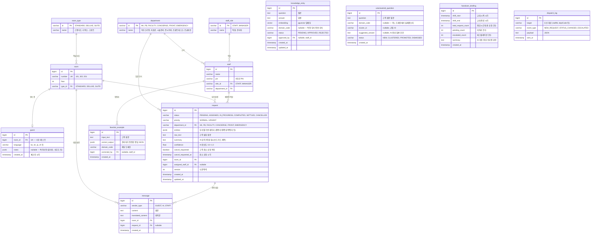

# 아늑(Aneuk) ERD

> **v2.0** — 도메인 기반 병렬 AI 구조 + 공통 JSON 스키마 + 정적 QR 인증 반영



## 테이블 요약

| 테이블 | 설명 | 레코드 수명 |
|--------|------|-----------|
| **department** | 부서 (HK, FB, FACILITY, CONCIERGE, FRONT, EMERGENCY) | 영구 |
| **room_type** | 객실 타입 (STANDARD, DELUXE, SUITE) | 영구 |
| **staff_role** | 직원 역할 (STAFF, MANAGER) | 영구 |
| **room** | 객실 정보 | 영구 |
| **staff** | 직원 (PIN 로그인) | 영구 |
| **guest** | 객실 ↔ 투숙객 매핑 (정적 QR, `notes` JSONB로 특이사항 통합) | 체크아웃 시 **Hard Delete** |
| **request** | 고객 요청 (핵심 테이블, `entities` JSONB로 가변 데이터 저장) | 영구 보존 |
| **message** | AI 대화 메시지 | 영구 보존 (원문 증거) |
| **knowledge_entry** | RAG 지식 DB (도메인별 분류 가능) | 영구 (승인된 것만 검색 대상) |
| **unanswered_question** | 미답변 질문 (플라이휠 소스) | 승인 후 knowledge_entry로 승격 |
| **fewshot_example** | AI 자가 튜닝용 정답 데이터 (Few-Shot) | 영구 (누적 학습) |
| **handover_briefing** | 교대 인수인계 브리핑 (AI 자동 생성) | 영구 보존 |
| **dispatch_log** | 실시간 알림 발송 이력 | 영구 (감사 로그) |

## 핵심 변경 사항 (v1 → v2)

| 항목 | v1 (기존) | v2 (변경) |
|------|-----------|-----------|
| Guest 인증 | `qr_token` (동적 토큰) | **정적 QR** (URL에 방번호 내장, 토큰 불필요) |
| 요청 데이터 | `item_code` + `quantity` (고정 컬럼) | **`jsonb entities`** (부서별 가변 데이터) |
| 부서 PK | `bigint id` + `varchar code` (분리) | **`varchar id`** (코드 자체가 PK, 6개: HK, FB, FACILITY, CONCIERGE, FRONT, EMERGENCY) |
| 부서 참조 | `bigint department_id FK` + `domain_code` 중복 | **`varchar department_id FK`** 하나로 통합 |
| AI 학습 | 없음 | **`fewshot_example`** 테이블 추가 |
| 투숙객 메모 | 없음 | **`guest.notes`** JSONB 컬럼으로 통합 (별도 테이블 없음) |
| 지식 DB | 단일 | **`domain_code`** 추가 (부서별 지식 분류) |

## 핵심 관계 설명

1. **guest ↔ room**: 1:1 (정적 QR — URL의 방번호로 인증, 체크아웃 시 Hard Delete)
2. **room → request**: 1:N (한 객실에서 여러 요청 발생)
3. **room → message**: 1:N (한 객실에서 여러 대화 발생)
4. **request → department**: N:1 (요청은 하나의 부서로 라우팅, `varchar department_id FK`)
5. **request → staff**: N:1 (요청은 한 직원에게 배정, nullable)
6. **request → message**: 1:N (요청과 관련된 대화)
7. **staff → fewshot_example**: 1:N (직원이 정정한 학습 데이터)

## `entities` JSONB 예시 (부서별)

### 하우스키핑 (HK)
```json
{
  "item": "수건",
  "quantity": 2
}
```

### 식음료 (FB)
```json
{
  "menu": "페퍼로니 피자",
  "spicy_level": "안 맵게",
  "allergy_info": "땅콩 빼주세요"
}
```

### 시설관리 (FACILITY)
```json
{
  "target_object": "에어컨",
  "symptom": "물이 뚝뚝 떨어짐"
}
```

### 컨시어지 (CONCIERGE)
```json
{
  "transport_type": "콜택시",
  "destination": "공항",
  "pickup_time": "오전 7시"
}
```

### 긴급 대응 (EMERGENCY)
```json
{
  "emergency_type": "FIRE",
  "location": "5층 복도",
  "situation": "연기 감지"
}
```

## 인수인계 브리핑 자동 생성 로직

```
교대 버튼 클릭
    │
    ▼
[백엔드] shift_start ~ shift_end 기간의 request 조회
    ├── ① 미완료 태스크 (status != COMPLETED)
    ├── ② 에스컬레이션 거친 특이사항 (confidence < 0.7 또는 ESCALATED)
    └── ③ 긴급/주요 완료 건 (priority = URGENT, HIGH)
    │
    ▼ (JSON으로 AI 서버에 전달)
[AI] 3~5줄 자연어 브리핑 자동 생성
    │
    ▼
[handover_briefing] 저장 (통계 + AI 요약)
```

> **핵심**: 직원이 인수인계 내용을 직접 작성하지 않음.
> request + message 데이터가 자동으로 취합되어 AI가 요약합니다.
