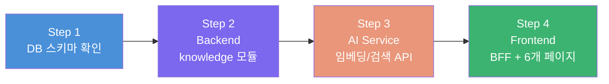

# RAG 지식 관리 공통 CRUD 인프라 구축 (Phase 1) — 최종

> **브랜치**: `young/feat/AN-246/RAG-infra`
> **목표**: 6개 도메인이 공유하는 RAG 지식 데이터 CRUD 풀스택 파이프라인을 구축한다.
> Phase 2에서 각 도메인 담당자가 독립적으로 고도화할 수 있는 "뼈대"를 완성하는 것이 핵심.

---

## ✅ 확정된 의사결정

| # | 항목 | 결정 |
|---|---|---|
| 1 | 임베딩 모델 | `text-embedding-004` (768차원, `schema.sql`의 `vector(768)`과 일치) |
| 2 | 도메인 코드 | `DomainCode` enum(`HK, FB, FACILITY, CONCIERGE, FRONT, EMERGENCY`) 그대로 사용 |
| 3 | 승인 워크플로우 | 직접 등록 시 **즉시 `APPROVED`** 처리. 학습 데이터 채택(ai-training)은 Phase 2로 이관 |
| 4 | 삭제 방식 | **물리 삭제** (`DELETE` + pgvector 임베딩 제거) — 설계서(UI-A-006) 명세 준수 |
| 5 | 기존 `rag` 페이지 | **전체 도메인 통합 뷰**로 유지 |
| 6 | 라우트 구조 | `admin/rag/{domain}/` 방식 (RAG 코드 응집) |

---

## 구현 단계 워크플로우



---

## Step 1. DB 스키마 확인

기존 [schema.sql L82-93](file:///home/young/workspace/team3-Anook/backend/src/main/resources/schema.sql#L82-L93)의 `knowledge_entry` 테이블 그대로 사용.

```sql
CREATE TABLE IF NOT EXISTS knowledge_entry (
    id              BIGSERIAL    PRIMARY KEY,
    question        TEXT         NOT NULL,
    answer          TEXT         NOT NULL,
    embedding       vector(768),
    domain_code     VARCHAR(20),
    status          VARCHAR(20)  NOT NULL DEFAULT 'PENDING',
    approved_by     BIGINT       REFERENCES staff(id),
    created_at      TIMESTAMP    NOT NULL DEFAULT NOW(),
    updated_at      TIMESTAMP    NOT NULL DEFAULT NOW()
);
```

> [!NOTE]
> 스키마 변경 불필요. `status`는 직접 등록 시 `APPROVED`로 INSERT 합니다.

---

## Step 2. Backend — `knowledge` 헥사고날 모듈 구현

기존 `.gitkeep`만 있는 빈 뼈대를 채웁니다. [request 모듈](file:///home/young/workspace/team3-Anook/backend/src/main/java/com/anook/backend/request)의 헥사고날 패턴을 답습합니다.

### 2-1. Domain Layer

#### [NEW] `knowledge/domain/model/KnowledgeEntry.java`
- 순수 POJO (JPA 어노테이션 금지)
- 필드: `id`, `question`, `answer`, `domainCode`, `status`, `approvedBy`, `createdAt`, `updatedAt`
- 행위 메서드: `updateContent(question, answer)`

#### [NEW] `knowledge/domain/model/KnowledgeStatus.java`
- enum: `PENDING`, `APPROVED` (Phase 1에서는 직접 등록 시 `APPROVED`만 사용)

### 2-2. Application Layer

#### Port In — UseCase

| 파일 | 메서드 |
|---|---|
| `CreateKnowledgeUseCase` | `create(CreateKnowledgeCommand)` → `CreateKnowledgeResult` |
| `GetKnowledgeListUseCase` | `getByDomain(String domainCode)` + `getAll()` → `List<GetKnowledgeResult>` |
| `GetKnowledgeDetailUseCase` | `getById(Long id)` → `GetKnowledgeDetailResult` |
| `UpdateKnowledgeUseCase` | `update(UpdateKnowledgeCommand)` |
| `DeleteKnowledgeUseCase` | `delete(Long id)` — 물리 삭제 |

#### Port Out

| 파일 | 역할 |
|---|---|
| `KnowledgeRepositoryPort` | CRUD + `findByDomainCode(String)` + `findAll()` |
| `EmbeddingPort` | `generateEmbedding(String text)` → `float[]` (AI 서비스 HTTP 호출 추상화) |

#### Service

| 파일 | 핵심 로직 |
|---|---|
| `CreateKnowledgeService` | 등록 + `EmbeddingPort` 호출 → 벡터와 함께 저장, **status = APPROVED** |
| `GetKnowledgeService` | 도메인별 / 전체 / 상세 조회 |
| `UpdateKnowledgeService` | 수정 + 임베딩 재생성 |
| `DeleteKnowledgeService` | **물리 삭제** (`DELETE FROM knowledge_entry`) |

#### DTO

| 폴더 | 파일 |
|---|---|
| `dto/request/` | `CreateKnowledgeCommand`, `UpdateKnowledgeCommand` |
| `dto/response/` | `CreateKnowledgeResult`, `GetKnowledgeResult`, `GetKnowledgeDetailResult` |

### 2-3. Adapter Layer

#### Adapter In — Controller

`knowledge/adapter/in/web/AdminKnowledgeController.java`

| HTTP | 경로 | 설명 |
|---|---|---|
| `POST` | `/admin/knowledge` | 지식 등록 (즉시 APPROVED) |
| `GET` | `/admin/knowledge?domain={code}` | 도메인별 목록 (domain 없으면 전체) |
| `GET` | `/admin/knowledge/{id}` | 상세 조회 |
| `PUT` | `/admin/knowledge/{id}` | 수정 + 재임베딩 |
| `DELETE` | `/admin/knowledge/{id}` | 물리 삭제 |

> [!NOTE]
> BFF 프록시가 `/api/admin/knowledge` → `/admin/knowledge`로 자동 전달하므로 `/api` 접두어 없음.

#### Adapter Out — Persistence

| 파일 | 역할 |
|---|---|
| `KnowledgeJpaEntity` | JPA Entity (`knowledge_entry` 테이블 매핑, pgvector 타입 포함) |
| `KnowledgeJpaRepository` | Spring Data JPA Repository |
| `KnowledgePersistenceAdapter` | Domain ↔ Entity 매핑, `KnowledgeRepositoryPort` 구현 |

#### Adapter Out — AI

| 파일 | 역할 |
|---|---|
| `EmbeddingAiAdapter` | `EmbeddingPort` 구현. Python AI 서비스 `/api/v1/rag/embed` 호출 |

### 2-4. Backend 파일 트리 요약

```
knowledge/
├── domain/model/
│   ├── KnowledgeEntry.java
│   └── KnowledgeStatus.java
├── application/
│   ├── port/in/
│   │   ├── CreateKnowledgeUseCase.java
│   │   ├── GetKnowledgeListUseCase.java
│   │   ├── GetKnowledgeDetailUseCase.java
│   │   ├── UpdateKnowledgeUseCase.java
│   │   └── DeleteKnowledgeUseCase.java
│   ├── port/out/
│   │   ├── KnowledgeRepositoryPort.java
│   │   └── EmbeddingPort.java
│   ├── service/
│   │   ├── CreateKnowledgeService.java
│   │   ├── GetKnowledgeService.java
│   │   ├── UpdateKnowledgeService.java
│   │   └── DeleteKnowledgeService.java
│   └── dto/
│       ├── request/
│       │   ├── CreateKnowledgeCommand.java
│       │   └── UpdateKnowledgeCommand.java
│       └── response/
│           ├── CreateKnowledgeResult.java
│           ├── GetKnowledgeResult.java
│           └── GetKnowledgeDetailResult.java
└── adapter/
    ├── in/web/
    │   └── AdminKnowledgeController.java
    └── out/
        ├── persistence/
        │   ├── KnowledgeJpaEntity.java
        │   ├── KnowledgeJpaRepository.java
        │   └── KnowledgePersistenceAdapter.java
        └── ai/
            └── EmbeddingAiAdapter.java
```

---

## Step 3. AI Service — 임베딩 & 검색 API

### 3-1. 인프라

#### [NEW] `ai/app/infrastructure/database/connection.py`
- `psycopg2` + `pgvector` 확장으로 PostgreSQL 연결
- `settings.DATABASE_URL` 활용

#### [NEW] `ai/app/infrastructure/embedding/client.py`
- Google `text-embedding-004` 모델 래퍼
- `generate_embedding(text: str) → List[float]` (768차원 벡터 반환)
- 기존 `gemini/client.py`(대화용)와 별도 파일로 분리

### 3-2. RAG 서비스

#### [NEW] `ai/app/domains/rag/service.py`

| 함수 | 설명 |
|---|---|
| `embed_text(text)` | 텍스트 → 768차원 벡터 변환 |
| `search_similar(query, domain_code, top_k, threshold)` | 유사도 검색 (0.7 미만 시 빈 결과) |

### 3-3. API 엔드포인트

#### [NEW] `ai/app/api/v1/endpoints/rag.py`

| HTTP | 경로 | 설명 | 호출 주체 |
|---|---|---|---|
| `POST` | `/api/v1/rag/embed` | 텍스트 임베딩 생성 반환 | Backend `EmbeddingAiAdapter` |
| `POST` | `/api/v1/rag/search` | 유사도 검색 | 도메인 에이전트 (Phase 2) |

#### [MODIFY] [router.py](file:///home/young/workspace/team3-Anook/ai/app/api/v1/router.py)

```diff
 from app.api.v1.endpoints.router import router as router_endpoint
+from app.api.v1.endpoints.rag import router as rag_endpoint

 api_router.include_router(router_endpoint, tags=["router"])
+api_router.include_router(rag_endpoint, prefix="/rag", tags=["rag"])
```

### 3-4. AI Service 파일 트리

```
ai/app/
├── infrastructure/
│   ├── database/
│   │   └── connection.py          ← [NEW] PostgreSQL + pgvector
│   └── embedding/
│       └── client.py              ← [NEW] text-embedding-004 래퍼
├── domains/
│   └── rag/
│       ├── __init__.py
│       └── service.py             ← [NEW] 임베딩/검색 로직
└── api/v1/
    ├── endpoints/
    │   └── rag.py                 ← [NEW] RAG API 엔드포인트
    └── router.py                  ← [MODIFY] RAG 라우터 등록
```

---

## Step 4. Frontend — BFF + 6개 도메인 RAG 페이지

### 4-1. 라우트 구조 (확정)

```
admin/rag/
├── page.tsx                              → /admin/rag (전체 도메인 통합 뷰)
├── page.module.css
├── useKnowledge.ts                       ← 공통 CRUD 훅 (6개 페이지 공유, Co-location)
├── _components/
│   └── KnowledgePageContent/
│       ├── KnowledgePageContent.tsx       ← 'use client', domainCode prop
│       ├── KnowledgePageContent.module.css
│       └── index.ts
│
├── hk/page.tsx                           → /admin/rag/hk
├── fb/page.tsx                           → /admin/rag/fb
├── facility/page.tsx                     → /admin/rag/facility
├── concierge/page.tsx                    → /admin/rag/concierge
├── front-desk/page.tsx                   → /admin/rag/front-desk
└── emergency/page.tsx                    → /admin/rag/emergency
```

### 4-2. 각 도메인 페이지 패턴

```tsx
// admin/rag/hk/page.tsx (Server Component — use client 없음)
import KnowledgePageContent from '../_components/KnowledgePageContent';

export default function HkRagPage() {
  return <KnowledgePageContent domainCode="HK" title="하우스키핑 지식 관리" />;
}
```

### 4-3. 공통 컴포넌트 변경

#### [MODIFY] 기존 Knowledge 컴포넌트 리팩토링

- `KnowledgeEditModal`: 카테고리 옵션을 하드코딩 → **props로 주입** 가능하게
- `KnowledgeItem`: `title`/`description` → `question`/`answer` 필드명 조정
- `KnowledgeModal`: 삭제 확인 기능 추가

### 4-4. 공통 CRUD 훅

#### [NEW] `admin/rag/useKnowledge.ts`

```typescript
interface KnowledgeEntry {
  id: number;
  question: string;
  answer: string;
  domainCode: string;
  status: string;
  createdAt: string;
  updatedAt: string;
}

export function useKnowledge(domainCode?: string) {
  // fetchList: GET /api/admin/knowledge?domain={domainCode}
  // create:    POST /api/admin/knowledge
  // update:    PUT /api/admin/knowledge/{id}
  // remove:    DELETE /api/admin/knowledge/{id}
  // + loading, error 상태
}
```

### 4-5. 기존 rag 페이지 리팩토링

#### [MODIFY] `admin/rag/page.tsx`
- 더미 데이터 제거 → `useKnowledge()` (domainCode 없음 = 전체 조회)로 교체
- `KnowledgePageContent` 재사용 (domainCode 없이)

### 4-6. BFF 프록시

기존 [catch-all proxy](file:///home/young/workspace/team3-Anook/frontend/src/app/api/%5B...path%5D/route.ts)가 자동 처리하므로 **별도 BFF route 추가 불필요**.

### 4-7. 사이드바 업데이트

#### [MODIFY] [Sidebar.tsx](file:///home/young/workspace/team3-Anook/frontend/src/components/layout/Sidebar.tsx)

기존 `지식 라이브러리` 메뉴를 확장형으로 변경하거나, 하위 도메인 링크를 추가할지는 구현 시 결정.

---

## 작업 순서 타임라인

| 순서 | 단계 | 예상 소요 | 주요 산출물 |
|---|---|---|---|
| 1 | DB 스키마 확인 | 30분 | 스키마 검증 완료 |
| 2 | Backend knowledge 모듈 | 3~4시간 | 헥사고날 CRUD 완성 (20개+ 파일) |
| 3 | AI Service 임베딩/검색 | 2~3시간 | `/rag/embed`, `/rag/search` API |
| 4 | Frontend 페이지 뼈대 | 2~3시간 | 6개 도메인 RAG 페이지 + 공통 훅 |
| 5 | 통합 테스트 | 1~2시간 | E2E 검증 |

---

## Verification Plan

### Automated Tests
1. **Backend 빌드**: `./gradlew build` 성공
2. **AI Service**: `uvicorn app.main:app` 기동 → `/health` 체크
3. **API 통합 테스트** (curl):
   - `POST /admin/knowledge` → 201 + status=APPROVED
   - `GET /admin/knowledge?domain=HK` → 200 + 해당 도메인만 필터
   - `GET /admin/knowledge` → 200 + 전체 목록
   - `PUT /admin/knowledge/{id}` → 200
   - `DELETE /admin/knowledge/{id}` → 204 + DB에서 물리 삭제 확인

### Manual Verification
- 프론트엔드 전체 뷰(`/admin/rag`) + 6개 도메인 페이지에서 CRUD 동작 확인
- 등록 시 AI 서비스 임베딩 API 호출 로그 확인
- 삭제 시 DB 레코드 완전 제거 확인
