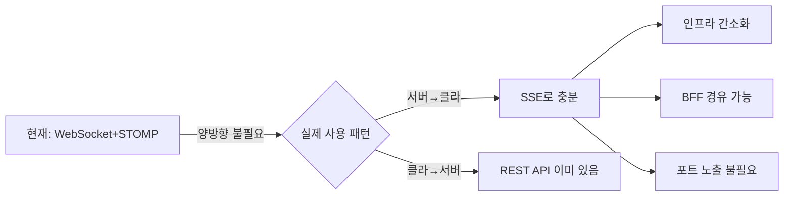

# WebSocket → SSE 전환 분석

---

## 0. WebSocket이란?

### HTTP vs WebSocket 근본적 차이

일반 HTTP는 **요청-응답** 모델입니다. 클라이언트가 물어봐야 서버가 대답합니다:

```
[HTTP] 항상 클라이언트가 먼저 말을 걸어야 함

클라이언트: "새 메시지 있어?"  → 서버: "없어"
클라이언트: "새 메시지 있어?"  → 서버: "없어"
클라이언트: "새 메시지 있어?"  → 서버: "있어! 여기."
    ↑ 이게 Polling (비효율적)
```

WebSocket은 **한번 연결하면 양쪽이 자유롭게 메시지를 주고받는** 프로토콜입니다:

```
[WebSocket] 연결 후 양방향 자유 통신

클라이언트 ←→ 서버 (지속 연결)

서버: "새 요청 왔어" (서버가 먼저 말함)
클라이언트: "수건 주세요" (클라이언트도 아무때나 보냄)
서버: "수건 접수됐어"
서버: "수건 배달 완료!"
```

### STOMP란?

WebSocket은 그냥 "바이트를 주고받는 파이프"일 뿐입니다. 여기에 **메시지 구조(헤더, 목적지, 구독)**를 더한 프로토콜이 STOMP입니다:

```
WebSocket = 전화선 (통화 가능하지만 규칙 없음)
STOMP     = 전화 예절 ("여보세요", 통화 종류 구분, 부서 연결)
```

현재 Anook은 **WebSocket + STOMP + SimpleBroker** 조합을 사용합니다.

---

## 0-1. 초기 전략에서 잘못 판단했던 부분

> 참고: [웹소켓_실시간통신_전략.md](file:///home/young/workspace/team3-Anook/docs/Reference/웹소켓_실시간통신_전략.md)

초기 전략 문서에서 WebSocket을 선택한 근거 3가지가 있었습니다. 하나씩 재검토합니다:

### ❌ 오판 1: "양방향이 필요하다"

초기 문서:
> | **WebSocket** | 양방향, 채널 분리 자유 | ✅ 채택 |

**실제로는 양방향을 쓰지 않았습니다.**

초기 설계에는 `/app/**` prefix로 클라이언트→서버 메시지를 보내는 발행 채널이 있었지만:

```java
// WebSocketConfig.java
registry.setApplicationDestinationPrefixes("/app");  // ← 정의만 해두고
```

실제 코드에서 `/app/*`으로 STOMP 메시지를 보내는 곳이 **단 한 군데도 없습니다.**
모든 "보내기"는 REST API(`POST`, `PATCH`)로 처리하고 있습니다:

```
메시지 전송:  POST /api/chat/{roomNo}/messages      ← REST
요청 수락:    PATCH /api/staff/requests/{id}/accept  ← REST
요청 완료:    PATCH /api/staff/requests/{id}/complete ← REST
```

> [!IMPORTANT]
> **"양방향이 필요하다"고 판단했지만, 실제로 구현된 양방향 통신은 0건입니다.**
> 서버→클라이언트 Push만 존재하며, 이것은 SSE로 100% 대체 가능합니다.

### ❌ 오판 2: "SSE는 채널 분리가 어렵다"

초기 문서:
> | **SSE** | 단방향 Push 간단 | 채널 분리(부서별/객실별) 어려움, 양방향 불가 |

**SSE에서도 채널 분리는 간단합니다:**

```
[WebSocket 채널 분리]
subscribe('/topic/room/707')     ← 1개 연결에서 여러 채널 구독
subscribe('/topic/dept/HK')

[SSE 채널 분리]
EventSource('/api/events/room/707')   ← URL 경로로 채널 분리
EventSource('/api/events/dept/HK')
```

SSE는 URL 경로 자체가 채널 역할을 합니다. 백엔드에서도 마찬가지:

```java
// WebSocket 방식
messagingTemplate.convertAndSend("/topic/room/707", payload);

// SSE 방식
sseEmitterMap.get("room/707").forEach(emitter -> emitter.send(payload));
```

**채널 분리 난이도는 동일합니다.** 차이는 WebSocket이 1개 연결로 여러 채널을 구독하고, SSE는 채널당 별도 연결이라는 것뿐입니다.

### ❌ 오판 3: 인프라 복잡도를 과소평가

WebSocket 도입으로 발생한 추가 인프라 작업들:

| 추가 작업 | SSE였다면 |  
|-----------|-----------|  
| Nginx에 `proxy_set_header Upgrade` 설정 | ❌ 불필요 |
| `proxy_read_timeout 86400s` 설정 | ❌ 불필요 |
| `ws://` → `wss://` 프로토콜 분기 코드 | ❌ 불필요 (일반 HTTPS) |
| 백엔드 포트(`8080`) 호스트 노출 필수 | ❌ BFF 경유 가능 |
| `@stomp/stompjs` 라이브러리 설치 | ❌ 브라우저 내장 `EventSource` |
| 배포 서버 SecurityError 디버깅 | ❌ 발생 안 함 |

> [!WARNING]  
> 실제로 배포 과정에서 `ws://`를 `wss://`로 전환하는 이슈, Nginx WebSocket 프록시 설정,
> 백엔드 포트 노출 문제 등이 모두 WebSocket 때문에 발생한 인프라 이슈였습니다.
> SSE였다면 이 문제들이 전부 없었습니다.

---

## 0-2. 왜 SSE로 대체가 가능한가 (구체적 근거)

### 근거 1: 모든 실시간 이벤트가 서버→클라이언트 단방향

초기 전략 문서의 시나리오 5개를 다시 보면:

| 시나리오 | 트리거 | Push 방향 | SSE 가능? |
|----------|--------|-----------|----------|
| 고객 메시지 → AI 응답 | REST API | 서버→Guest | ✅ (또는 동기 응답) |
| 직원 수락 → 투숙객 알림 | REST API | 서버→Guest | ✅ |
| 직원 완료 → 투숙객 알림 | REST API | 서버→Guest | ✅ |
| 직원 응답 → 투숙객 메시지 | REST API | 서버→Guest | ✅ |
| 관리자 재배정 | REST API | 서버→Staff/Guest | ✅ |

**모든 시나리오에서 트리거는 REST API이고, Push는 서버→클라이언트 단방향입니다.**

### 근거 2: 채팅 AI 응답은 동기 HTTP로 더 단순해짐

```
[현재: 비동기 2단계]
1. POST /chat/707/messages → 200 (messageId만)
2. (대기) → WebSocket Push로 AI 응답 수신  ← 별도 채널 필요

[SSE 전환 시: 동기 1단계]
1. POST /chat/707/messages → 200 (AI 응답 포함)
   { messageId: 1, aiContent: "수건 2장 보내드리겠습니다" }
```

채팅 응답은 WebSocket/SSE 조차 불필요합니다. 그냥 HTTP 응답에 AI 답변을 담으면 됩니다.

### 근거 3: 헥사고날 아키텍처의 DispatchPort가 기술 교체를 쉽게 함

현재 `DispatchPort` 인터페이스가 WebSocket을 추상화하고 있습니다:

```java
// 현재: WebSocket 구현
public class WebSocketDispatchAdapter implements DispatchPort {
    void send(String channel, String eventType, Object payload) {
        messagingTemplate.convertAndSend(channel, wrapped);
    }
}

// 전환: SSE 구현 (Port 인터페이스 변경 없음!)
public class SseDispatchAdapter implements DispatchPort {
    void send(String channel, String eventType, Object payload) {
        emitterMap.get(channel).forEach(e -> e.send(wrapped));
    }
}
```

**Service 코드는 한 줄도 안 바꿔도 됩니다.** Adapter만 교체하면 끝입니다.
이것이 헥사고날 아키텍처의 장점이며, 기술 전환 비용이 낮은 이유입니다.

## 1. SSE로 바꿔도 괜찮은 이유

### 현재 모든 실시간 통신은 "서버 → 클라이언트" 단방향

Anook 프로젝트의 실시간 통신을 전수 조사하면, **양방향이 필요한 기능이 하나도 없습니다:**

| 기능 | 데이터 흐름 | 현재 방식 | SSE+REST 대체 |
|------|------------|----------|---------------|
| 게스트 메시지 전송 | 클라 → 서버 | REST API (`POST /chat/{roomNo}/messages`) | ✅ REST 그대로 |
| AI 응답 수신 | 서버 → 클라 | WebSocket `/topic/room/{roomNo}` | ✅ **동기 HTTP 응답**으로 대체 가능 |
| 요청 상태 변경 알림 | 서버 → 클라 | WebSocket `/topic/room/{roomNo}` | ✅ SSE |
| 직원 새 요청 알림 | 서버 → 클라 | WebSocket `/topic/dept/{deptCode}` | ✅ SSE |
| 직원 수락/완료 | 클라 → 서버 | REST API (`PATCH /staff/requests/{id}`) | ✅ REST 그대로 |
| 관리자 알림 | 서버 → 클라 | WebSocket `/topic/admin` | ✅ SSE |

> [!IMPORTANT]
> **클라이언트 → 서버 방향은 전부 REST API로 이미 구현되어 있습니다.**
> WebSocket을 통해 클라이언트가 서버에 메시지를 보내는 코드가 없습니다. (`/app/*` prefix로 STOMP 메시지를 보내는 곳이 없음)

### 채팅 AI 응답: 동기 응답이 더 자연스러움

현재 채팅 플로우:
```
1. POST /chat/707/messages → 200 OK (messageId만 반환)
2. (대기...)
3. AI 응답이 WebSocket으로 Push
```

동기 응답으로 바꾸면:
```
1. POST /chat/707/messages → 200 OK (AI 응답 포함하여 반환)
   { guestMessageId: 1, aiResponse: "수건 2장 요청 접수했습니다" }
```

- AI 응답 대기 시간은 보통 1~3초 → HTTP 타임아웃 안에 충분히 처리 가능
- 프론트에서 `isTyping` 로딩 표시 후, 응답 받으면 바로 렌더링
- **더 단순하고 예측 가능한 코드**

---

## 2. 전환 시 문제가 생길 수 있는 부분

### ⚠️ SSE 연결 제한 (브라우저 한계)

> [!WARNING]
> **HTTP/1.1 기준: 브라우저 1개당 같은 도메인에 최대 6개 동시 연결**
> SSE 연결 1개가 이 중 1개를 차지합니다.

이것이 "6명 제한" 으로 들으셨을 수 있는 부분인데, 정확히 말하면:

- ❌ **"서버에 6명만 접속 가능"이 아닙니다**
- ✅ **"한 브라우저(탭)에서 같은 도메인으로 SSE 연결을 6개까지만 열 수 있다"** 는 뜻입니다

```
[사용자 A의 브라우저]
├── SSE /events/room/707      ← 1개
├── SSE /events/dept/HK       ← 2개
├── 일반 API fetch             ← 3개
├── 이미지 로딩               ← 4개
├── CSS/JS 로딩               ← 5개, 6개
└── 7번째 요청 → 대기 ❌       ← 이전 연결 중 하나가 끝나야 실행
```

**Anook에서는 문제 없는 이유:**
- 게스트: SSE 1개 (자기 방 상태 구독) → 여유 충분
- 직원: SSE 1~2개 (부서 알림 + 관리자 알림) → 여유 충분
- HTTP/2 환경(HTTPS + Nginx): **이 제한이 사실상 없음** (멀티플렉싱)

> [!TIP]
> 현재 배포 서버가 HTTPS(HTTP/2)를 사용하므로, SSE 연결 제한은 실질적으로 적용되지 않습니다.

### ⚠️ 마이그레이션 비용

| 변경 대상 | 작업량 |
|-----------|--------|
| 백엔드: `SimpMessagingTemplate` → `SseEmitter` 전환 | 중간 |
| 프론트: `@stomp/stompjs` → `EventSource` API 전환 | 낮음 |
| 프론트: `useWebSocket.ts` 훅 → `useSSE.ts` 훅 전환 | 낮음 |
| 프론트: `useChat.ts` WebSocket 제거 → 동기 응답 | 낮음 (오히려 간소화) |
| 백엔드: `WebSocketConfig.java` 제거 | 낮음 |
| 배포: Nginx WebSocket 프록시 설정 불필요 | 삭제 (간소화) |

### ⚠️ SSE 연결 끊김 관리

- SSE는 연결이 끊기면 브라우저가 **자동 재연결** 합니다 (EventSource 기본 동작)
- 단, 재연결 사이에 놓친 이벤트를 복구하려면 `Last-Event-ID` 헤더 처리 필요
- Anook의 경우: 재연결 시 REST API로 현재 상태를 다시 가져오면 되므로 큰 문제 아님

---

## 3. 성능 비교

### 개선되는 부분 ✅

| 항목 | WebSocket | SSE | 개선 |
|------|-----------|-----|------|
| **인프라 복잡도** | ws/wss 프로토콜, STOMP, Nginx 별도 설정 | 일반 HTTP, 추가 설정 없음 | ✅ 대폭 간소화 |
| **BFF 경유** | 불가 → 백엔드 포트 노출 필수 | 가능 → 포트 숨김 가능 | ✅ 보안 향상 |
| **라이브러리 의존** | `@stomp/stompjs` (프론트), STOMP 설정 (백엔드) | 브라우저 내장 `EventSource` | ✅ 번들 사이즈 감소 |
| **디버깅** | WebSocket 프레임 분석 필요 | 브라우저 Network 탭에서 바로 확인 | ✅ 개발 편의성 |
| **프록시 호환** | 일부 프록시에서 WebSocket 지원 안 함 | 모든 HTTP 프록시 통과 | ✅ 호환성 |

### 동일하거나 약간 불리한 부분 ⚠️

| 항목 | WebSocket | SSE | 비교 |
|------|-----------|-----|------|
| **레이턴시** | ~1ms | ~1ms | ≈ 동일 |
| **다중 채널** | 1연결로 N개 채널 구독 | 채널당 별도 연결 | ⚠️ SSE 약간 불리 |
| **연결 오버헤드** | 1개 연결 유지 | 역할별 1~2개 연결 | ⚠️ SSE 약간 불리 |
| **메모리 (서버)** | 연결당 ~2KB | 연결당 ~1KB | ✅ SSE 유리 |

> [!NOTE]
> Anook의 동시 사용자 규모(호텔 1개, 최대 23실 + 직원 수명)에서는 성능 차이가 체감되지 않습니다.

---

## 4. 결론

### SSE 전환 권장 이유 요약



| 판단 기준 | 결론 |
|-----------|------|
| 양방향 필요? | ❌ 없음 |
| SSE 연결 제한 문제? | ❌ HTTP/2에서 해소 |
| 성능 저하? | ❌ 체감 없음 |
| 인프라 간소화? | ✅ 확실히 개선 |
| **전환 추천?** | ✅ **추천 (단, 일정 여유 있을 때)** |
