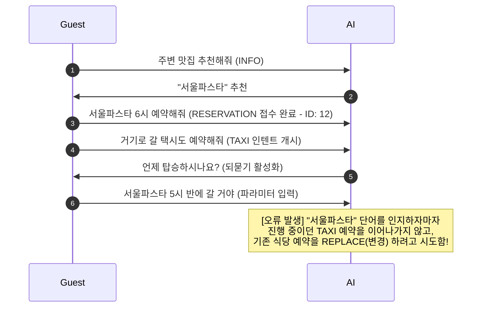

# 🎤 VenueOn 발표 기술 어필 가이드북 (AI & Backend Architecture)

이 가이드는 **아늑(Aneuk) 서비스**의 핵심 AI 파트 및 백엔드 연계 아키텍처를 설계/개발한 개발자로서, 발표 현장에서 심사위원(개발자 및 기획자)들에게 가장 강력하게 기술적 역량을 어필할 수 있는 핵심 요소를 선별하여 정리한 자료입니다.

---

## 📌 1. 내가 담당한 핵심 기술 아키텍처 & 어필 포인트

> [!NOTE]
> 단순한 "API 호출기" 수준의 AI 연동이 아닌, **실제 서비스 운영 환경에서 발생할 수 있는 Latency, 비용, 할루시네이션(Hallucination), 그리고 예외 상황(Edge Case)**을 시스템 아키텍처 레벨에서 어떻게 방어하고 극대화했는지를 어필해야 합니다.

### 💎 어필 포인트 A. 초경량 태스크 코드화(Task Code) 및 One-Pass 아키텍처
*   **배경 및 문제**: 외부 AI API(Gemini) 호출 시 언어 감지, 번역, 의도 분류 등을 개별 API 호출로 처리하면 지연 시간(Latency)이 중첩되어 사용자 경험이 크게 저하되고, 호출 토큰 비용이 기하급수적으로 증가함. 또한 AI가 유려한 자연어로 대답할 경우 백엔드에서 이를 파싱(Parsing)하다가 잦은 오류가 발생함.
*   **나의 해결책 (Task Code & One-Pass)**:
    *   **One-Pass Prompting**: 입력 언어가 영어, 일어, 중국어이든 상관없이 단 1번의 프롬프트 호출로 번역, 다국어 감지, 의도 분류, 엔티티 추출을 동시에 수행하도록 싱글 루프 설계.
    *   **자연어 → 코드 포맷팅**: 무거운 JSON 포맷 대신 사전에 정의된 구분자 기법(`|`)을 사용해 AI에게 **`[부서]|[긴급도]|[분류]|[아이템]|[수량]`** 규격(예: `HK|NORM|REQ_ITEM|TOWEL|2`)으로만 응답하도록 강제 통제.
*   **어필 효과**: 
    *   AI 응답에 소요되는 **출력 토큰 사용량 약 80~90% 절감**.
    *   백엔드 파싱 에러율 **0% 구현** (할루시네이션으로 규격 외 코드를 뱉을 경우 백엔드 Enum 캐스팅 방어막을 통해 자동으로 `UNDEFINED` 처리 후 수동 Fallback 큐로 이관).

### 💎 어필 포인트 B. 하이브리드 에스컬레이션 & Human-in-the-loop 설계
*   **배경 및 문제**: AI는 100% 완벽할 수 없으며, 호텔 현업인들은 시스템의 오작동 리스크를 극도로 경계함. AI가 잘못 예측한 업무를 억지로 가동하면 현장 직원의 피로도가 극대화됨.
*   **나의 해결책**:
    *   **Confidence 기반 에스컬레이션**: AI의 분석 확신도(Confidence Score)가 `0.7` 미만이거나, 호텔의 표준 비품 테이블에 등록되지 않은 특수/비표준 요청(예: "가습기", "종이컵" 등 - `ETC` 분류)일 경우 **확신도를 강제로 하향 조정**.
    *   **되묻기(Clarification)와 이관의 유기적 연동**:
        *   필수 정보가 빠진 비정형 요청(예: "주세요")은 AI가 즉시 이관하지 않고 **되묻기 시나리오**를 전개하여 슬롯(Slot-filling)을 채움.
        *   정보는 명확하나 호텔 규격 외 비품 요청인 경우, 고객에게 에러를 내는 대신 **프론트 데스크 관리자 컨펌 대기열**로 자연스럽게 이관하여 사람이 직접 개입(Human-in-the-loop)하여 승인/반려하도록 설계.

### 💎 어필 포인트 C. 데이터 플라이휠(Data Flywheel) & RAG 고도화
*   **배경 및 문제**: 초기 오픈 시점(Cold-Start)에는 모든 고객 질문에 대응하는 RAG(검색용 지식 베이스)를 완벽하게 구축하는 것이 불가능함.
*   **나의 해결책**:
    *   RAG 검색 실패로 인해 사람이 수동 대응한 질문들을 버리지 않고 DB에 자동 적재.
    *   LLM을 활용해 미답변 질문들을 군집화(Clustering)하고, 관리자 대시보드에 `주간 RAG 업데이트 추천 리스트`로 노출.
    *   관리자가 원클릭 승인 시 즉시 임베딩 벡터화하여 `pgvector` 기반 지식 DB 반영.
*   **어필 효과**: 운영 기간이 길어질수록 시스템이 스스로 지식을 학습하고 도메인에 자생적으로 진화(Evolution)하는 데이터 선순환 구조 구축.

### 💎 어필 포인트 D. 데이터 기반 AI 교대 인수인계 브리핑 (Shift Handover)
*   **배경 및 문제**: 호텔 근무 교대 시 수많은 정적 로그와 엑셀 시트를 보며 수작업으로 인수인계 업무를 요약하고 전달하느라 커뮤니케이션 오버헤드가 매우 큼.
*   **나의 해결책**:
    *   백엔드 데이터 그리드에서 당일 미처리 업무, 에스컬레이션 특이사항, 긴급도 HIGH 업무의 메타데이터를 정밀 필터링하여 단일 컨텍스트로 LLM에 주입.
    *   "다음 근무자를 위한 잔여 업무 목록 및 특이사항 요약 브리핑"을 단 3~5줄의 명료한 자연어로 자동 생성하는 원클릭 인수인계 파이프라인 완성.

---

## 🛠️ 2. 트러블슈팅 사례 (Troubleshooting) - 가장 강조해야 할 핵심 경험

발표 시 면접관/심사위원이 가장 좋아하는 세션은 **"문제 상황 -> 분석 -> 해결 -> 검증"**이 명확한 트러블슈팅 스토리입니다. 최근에 해결한 멀티턴 대화 세션 컨텍스트 충돌 이슈를 어필하세요.

### 🚨 [Trouble] 식당 예약 완료 후 택시 호출 시의 컨텍스트 경합 버그

> **"사용자가 식당 예약을 성공적으로 마친 후, 연이어 해당 식당으로 가기 위해 택시를 예약하려 하자 AI가 기존 식당 예약 내용을 수정하려는 것(REPLACE)으로 오인하는 심각한 컨텍스트 전이 오류 발생"**

*   **원인 분석**: 
    1.  AI 에이전트의 이전 컨텍스트 히스토리에 "서울파스타"와 "예약 내역(ID: 12)"이 강력한 연관 관계(Embedding)를 형성하고 있었음.
    2.  새로운 `TAXI` 인텐트의 목적지 슬롯을 채우기 위한 되묻기 과정에서 사용자가 "서울파스타"를 다시 언급하자, AI는 TAXI의 목적지가 아닌 **기존 active 예약 내역을 덮어쓰거나(REPLACE) 수정**하려는 의도로 오인함.
*   **해결 전략 (시스템 제약 규칙 설계)**:
    *   프롬프트 엔진(`concierge_prompt.py`)에 **`Rule 11. SLOT-FILLING PRIORITY FOR ACTIVE INQUIRY`** 명문화.
    *   "직전 AI 질문이 새로 시작된 활성 인텐트(예: TAXI)의 누락 슬롯을 채우기 위한 되묻기(Clarification) 상태였고, 사용자가 특정 장소/식당명 등을 입력한 경우, 타 인텐트 전환이나 기존 예약의 REPLACE를 원천 차단하고 **현재 활성 인텐트의 슬롯 파라미터(예: TAXI의 `destination`)로 최우선 매핑**한다"는 우선순위 가드레일 설치.
*   **검증 결과**:
    *   비동기 시나리오 시뮬레이션 테스트 스크립트(`test_taxi_flow.py`)를 구축하여 연속 대화 흐름을 테스트한 결과, 식당 정보가 기존 예약을 훼손하지 않고 새로 호출된 택시의 `destination` 슬롯에만 정확히 할당되는 것을 검증 완료.

---

## 🎬 3. 시연 영상용 컨시어지 파트 시나리오 (Concierge Demo Scenario)

> [!TIP]
> 발표 자료의 꽃인 시연 영상에 사용될 **컨시어지 에이전트 파트 시나리오**입니다. 인텐트의 전환, RAG 검색, 되묻기(Clarification), 그리고 컨시어지와 프론트 간의 유기적 이관을 물 흐르듯 직관적으로 보여주는 흐름으로 구성되었습니다.

## 🎬 4. 시연 영상용 스크립트 (Pure Demo Script)

> [!TIP]
> 기술 분석 및 설명자막용 노트를 배제하고, 실제 촬영 및 멘트 리딩 시 참고할 수 있도록 순수 대화 흐름만 정제한 시나리오입니다.

*   **고객**: "체크아웃 한 다음에도 짐 보관할 수 있나요?"
*   **AI 에이전트**: "네, 고객님! 저희 아늑 호텔에서는 체크아웃 하신 당일에 한하여 1층 로비 컨시어지 데스크에서 무료로 수하물 보관 서비스를 제공하고 있습니다. 보관하실 가방 개수와 찾으러 오실 시간을 알려주시면 접수해 드리겠습니다."
*   **고객**: "네 캐리어 2개고, 오늘 저녁 6시에 찾으러 갈게요."
*   **AI 에이전트**: "보관 요청을 확인했습니다. 캐리어 2개를 오늘 저녁 18:00까지 보관하는 수하물 보관 요청을 등록해 드릴까요?"
*   **고객**: [예] 클릭 (또는 "응 등록해줘")
*   **AI 에이전트**: "감사합니다. 수하물 보관 요청이 정상적으로 완료되었습니다. 1층 컨시어지 데스크에 수하물을 전달해 주시면 감사하겠습니다."
*   **고객**: "그리고 내일 탈 택시도 하나 예약해줘."
*   **AI 에이전트**: "내일 탑승하실 택시 예약을 도와드리겠습니다. 목적지(어디로), 탑승 시간(몇 시), 그리고 탑승 인원(몇 명)을 알려주시겠습니까?"
*   **고객**: "아침 8시에 서울역으로 갈 거야. 그리고 가기 전에 아까 보관한 짐은 미리 찾을 거고."
*   **AI 에이전트**: "내일 아침 08:00에 서울역으로 가시는 택시 정보를 반영했습니다. 마지막으로 탑승하실 인원은 총 몇 명이신가요?"
*   **고객**: "2명 탈 거야."
*   **AI 에이전트**: "감사합니다. 내일 아침 08:00에 서울역으로 가시는 택시(2명) 예약을 확정해 드릴까요? (보관하신 수하물은 퇴실 및 출발 전에 미리 수령하실 수 있도록 프론트에 전달해 두겠습니다.)"

### 🎭 시나리오 타임라인 및 화면 연출 구체내용

#### [Scene 1: 정보 질의 (RAG & INFO)]
*   **사용자 입력**: `"체크아웃 한 다음에도 짐 보관할 수 있나요?"`
*   **AI 백그라운드 동작**: `intent: INFO`, RAG 지식 DB에서 수하물 보관 규정 조회.
*   **AI 응답 (화면 노출)**: `"네, 고객님! 저희 아늑 호텔에서는 체크아웃 하신 당일에 한하여 1층 로비 컨시어지 데스크에서 무료로 수하물 보관 서비스를 제공하고 있습니다. 보관하실 가방 개수와 찾으러 오실 시간을 알려주시면 접수해 드리겠습니다."`
*   **💡 발표 어필 포인트**: 단순 고정 답변이 아닌, RAG DB 연동을 통한 동적 FAQ 지식 답변 동작 확인.

#### [Scene 2: 다중 정보 되묻기 (Clarification & Slot-Filling)]
*   **사용자 입력**: `"네 캐리어 2개고, 오늘 저녁 6시에 찾으러 갈게요."`
*   **AI 백그라운드 동작**: 수하물 보관(`LUGGAGE_STORAGE`) 인텐트 인식. 필수 정보인 수량(quantity: 2), 수령 예정 시간(pickup_time: 18:00) 자동 추출.
*   **AI 응답 (화면 노출)**: `"보관 요청을 확인했습니다. 캐리어 2개를 오늘 저녁 18:00까지 보관하는 수하물 보관 요청을 등록해 드릴까요?"` [예 / 아니오 버튼 노출]
*   **💡 발표 어필 포인트**: 누락된 파라미터(수량, 시간)를 고객에게 친절하게 되물어 수집하는 슬롯 필링 메커니즘 시각화.

#### [Scene 3: 최종 등록 및 백엔드 전송]
*   **사용자 조작**: `[예]` 버튼 클릭 (또는 `"응 등록해줘"` 입력)
*   **AI 백그라운드 동작**: 최종 확정 인지. `final_reply: [FORWARD_CONCIERGE]` 응답 포맷 리턴. 백엔드에서 정식 업무 태스크 객체로 변환하여 컨시어지 부서 전용 대시보드로 실시간 큐 전송.
*   **AI 응답 (화면 노출)**: `"감사합니다. 수하물 보관 요청이 정상적으로 완료되었습니다. 1층 컨시어지 데스크에 수하물을 전달해 주시면 감사하겠습니다."`

#### [Scene 4: 다단계 슬롯 필링 및 컨텍스트 충돌 방지 (Multi-turn Slot-Filling & Conflict Prevention)]
*   **사용자 입력**: `"그리고 내일 탈 택시도 하나 예약해줘."` (세부 정보 유실 상태로 신규 요청)
*   **AI 백그라운드 동작**: `intent: TAXI` 신규 감지. 필수 정보인 `destination`, `time`, `passenger_count`가 모두 빠져 있으므로 1차 되묻기(Clarification) 개시.
*   **AI 응답 (화면 노출)**: `"내일 탑승하실 택시 예약을 도와드리겠습니다. 목적지(어디로), 탑승 시간(몇 시), 그리고 탑승 인원(몇 명)을 알려주시겠습니까?"`
*   **사용자 입력**: `"아침 8시에 서울역으로 갈 거야. 그리고 가기 전에 아까 보관한 짐은 미리 찾을 거고."` (세부 정보 중 2개만 부분 응답 + 이전 예약 수하물 언급)
*   **AI 백그라운드 동작**: 
    *   **Rule 11 작동**: 사용자가 이전 예약과 관련된 "짐 수령"을 언급했으나, 현재 대화 흐름의 초점은 `TAXI` 인텐트의 슬롯 채우기이므로 기존 수하물 예약을 취소/수정(`REPLACE`)하지 않고 그대로 둔 채 TAXI 정보로 매핑.
    *   **부분 슬롯 필링**: 목적지(`destination: 서울역`)와 시간(`time: 08:00`) 2가지 정보만 추출 및 누적 저장. 마지막 필수 필드인 `passenger_count`가 누락되었으므로 2차 되묻기 개시.
*   **AI 응답 (화면 노출)**: `"내일 아침 08:00에 서울역으로 가시는 택시 정보를 반영했습니다. 마지막으로 탑승하실 인원은 총 몇 명이신가요?"`
*   **사용자 입력**: `"2명 탈 거야."` (마지막 정보 응답)
*   **AI 백그라운드 동작**: 마지막 슬롯 완벽 충족 (`passenger_count: 2`). 모든 필수 데이터 수집 완료. `action_type: ADD`.
*   **AI 응답 (화면 노출)**: `"감사합니다. 내일 아침 08:00에 서울역으로 가시는 택시(2명) 예약을 확정해 드릴까요? (보관하신 수하물은 퇴실 및 출발 전에 미리 수령하실 수 있도록 프론트에 전달해 두겠습니다.)"` [예 / 아니오 버튼 노출]
*   **💡 발표 어필 포인트**: 
    1.  필수 파라미터가 비어 있을 때 단계적으로 정보를 나누어 묻고 수집해 나가는 **다단계 슬롯 필링(Multi-turn Slot-Filling)** 구현력.
    2.  복합 발화("짐 찾을 거야") 속에서도 흔들림 없이 진행 중인 슬롯에 집중하여 컨텍스트 충돌을 예방하는 **Rule 11 정책**의 강력한 어필.

---

